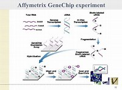
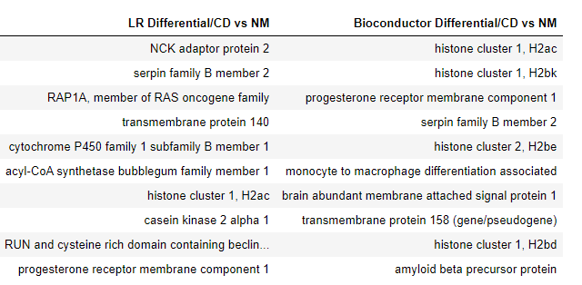

# Differential-Gene-Expresion-of-Ulcerative-Colitis-and-Crohn-s-Disease
Differential Gene Expression Analysis and Model Creation

### Managing Microarray Expression Data

The field of biology has changed drastically since Mendel studied genetics by growing pea plants in the 18th century. The structure of DNA was elucidated by Watson and Crick in the 1950’s, thereby giving birth to the age of cell and molecular biology.  In 1995, the first study using ‘microarrays’, which attached cDNA sequences to glass for gene expression analysis was published [1]. Much of the genomic data collected today is via high-throughput instruments, as opposed to individual experiments performed by scientists, and experimental bioanalysis has evolved into computational biology.  Computational biology has been broken down in many different components such as proteomics (computational study of proteins), metabolomics (computational study of metabolites), and genomics (computational study of genes), just to name a few.  Likewise, the NIH NCBI database has grown exponentially over the last 25 from a cDNA and genomic data repository to a massive database by adding RNA expression analysis via microarrays.  These data arise from a combination of time series and endpoint differential gene expression studies.   

Genomics, also referred to as bioinformatics, applies statistics and information theory to understand genomic data.  Genomic data can consist of sequencing the genome directly or the expressed genes as they are produced.  Two types of data that arise from cDNA (copies of RNA) microarrays are sequenced mutated genes and RNA expression, which can demonstrate abnormalities in the expression of the gene.  One of the advantages of studying this type of data is the ability to tailor treatments from patient samples.  Some companies, such as Invitae, produce microarrays specifically to analyze RNA for altered expression. According to Invitae’s web site, ”Invitae has incorporated supplemental RNA testing into the variant classification process for variants of uncertain significance (VUS). We will be analyzing VUS that are predicted to affect splicing and have been identified in a gene from any of our hereditary cancer panels.” [2]

The human genome contains approximately 21,000 genes, of which 95% are alternatively spliced.[3]  Alternative splicing allows the different elements of each gene to be combined in different ways to produce the gene with varying lengths and features.  Multiplying genes by their splicing variants and  by the cells tested exponentiates the amount of data produced.  Datasets created from microarrays generally contain over 15,000 genes and this amount of data leads to the ‘curse of dimensionality’.   Likewise, ‘housekeeping genes’ are highly correlated as they are expressed continually and in conjunction with one another to keep the cell alive and functioning.

### Problem Statement

Ulcerative colitis and Crohn’s disease are common bowel diseases causing intestinal inflammation and tissue damage. Both are mediated by T-cell responses. [4]  Disease is diagnosed by tissue biopsies obtained through colonoscopies, which are invasive and potentially risky.  The samples in this study were obtained by blood draws and tested for immunologically active genes that would indicate disease.  Blood samples are much easier to obtain, less expensive, and contain as much information as a biopsy.  In this study I will analyze the microarray data for differentially expressed gene combinations that indicate disease and create a model that would predict which disease, if any, the patient is presenting.

The most often used, open-sourced, library to analyze genomic data is the limma package from Bioconductor, which is written in R code, and has been in continuous production since 2003. [5] The limma package contains many powerful libraries for normalization and analysis and is a very powerful tool for genomics.  This can be imported on a terminal such as RStudio.  According to the limma manual, “These functions are used to rank genes in order of evidence for differential expression. They use an empirical Bayes method to squeeze the genewise residual variances towards a common value (or towards a global trend) (Smyth, 2004; Phipson et al, 2016).” [5]  Another package used in conjunction with limma is the UMAP library.  This library is not confined to R code and can be used with conda installation.  According to the UMAP documentation, “Uniform Manifold Approximation and Projection (UMAP) is a dimension reduction technique that can be used for visualisation similarly to t-SNE, but also for general nonlinear dimension reduction. [6] The NIH NCBI database also uses this package through the Gene Expression Omnibus (Geo) Platform on their website [7].  Researchers upload experimental microarray data to the site and can analyze their data or create custom tools with libraries and APIs. [8] It is also possible to purchase other software packages, such as  Genomatix (https://www.genomatix.de/online_help/help_regionminer/pca.html), which relies on PCA as the sole component for differential analysis.

A central idea of science is the reproducibility of results.  If an experimental result cannot be replicated under the same reported conditions, the data cannot be trusted.  Compounding the problem of reproducibility, is the lack of  knowledge statistical model generation in the field of DNA sciences.  Most researchers rely on packages, such as limma, to analyze and return reliable computations.  Generally computational results are confirmed through laboratory experiments, such as TaqMan PCR for RNA expression.  What if a researcher wants to reproduce both laboratory and computational results?  Most likely, this individual will not have the tools to do the latter.  In this study, I would like to reproduce the results of differential gene expression from the limma library with PCA and a regularized logistic regression model.

### Data Acquisition and Cleaning

The microarray data for this comparison is from a study that examined the differential expression between the peripheral blood mononuclear cells (PBMCs) of patients with ulcerative colitis (UC) and Crohn’s disease (CD).   Each of these diseases has a characteristic presentation with regard to cell and tissue damage.  The data set analyzed in this study contains measurements of the expression levels of 22,283 genes in PBMCs. Data for 127 subjects are included, 26 of whom have ulcerative colitis, and 59 of whom have Crohn's disease, and the remaining are subjects that have neither ulcerative colitis or Crohn’s disease.[4]  The original paper verified the differential expression by TaqMan PCR analysis.  

The data was downloaded from the NCBI database (accession number GSE3365) in SOFT format.  The SOFT format is a text document with raw microarray readings and metadata from the experiment, patient demographics and disease classification in this set.  The raw microarray data is transformed into log2 scale for statistical analysis.  The table is then transformed such that the gene rows become the columns, or features, and the sample columns become the rows.  The last transformation is scaling the data for PCA analysis and statistical modeling. For the modeling, a categorical column was added that identified each sample as UC (ulcerative colitis), CD (Crohn’s disease), or NM (normal).

### Results

PCA analysis of the entire dataset composed of all three sample types returned a cumulative explained variance score for 50 Components (genes) of 0.70. For 100 components (genes) the cumulative explained variance returned 0.91.  The components (genes) were matched with accession numbers to return a list of the top 10 genes.  These were combined with results from the Bioconductor analysis in tabular form.   PCA was performed on ulcerative colitis vs. normal samples, Crohn’s disease vs. normal samples, and ulcerative colitis vs. Crohn’s disease samples.  None of the top 10 genes in either PCA or Bioconductor matched each other in any of the four comparisons.  Likewise, K-Means clustering did not achieve distinct and cohesive clusters, in spite of knowing the number of clusters before the analysis.  Although, in comparison, the UMAP from Bioconductor also did not form clear clusters from its algorithm.

Three-sample classification was performed by kNN and Random Forest models with and without PCA reduction.  Random Forest was chosen because it also selects a subset of features to train the model. The data were passed through gridsearch for optimal parameters.  Summary tables of each model are below.  Also a summary of the top 10 genes produced with Random Forest compared with Bioconductor.  

Binary classification through logistic regression, default parameters, both with and without PCA reduction, of ulcerative colitis vs. normal samples and Crohn’s disease vs. normal samples are summarized in the table below.  Also, tables comparing the top 10 genes in this model compared to the Bioconductor analysis is included, as well as tables of the top 15 genes both upregulated and downregulated.  The ulcerative colitis vs. normal samples model produced four of the same genes, and the Crohn’s disease vs. normal samples model produced three of the same genes, in comparison to the Bioconductor analysis.

### Conclusions

A large percentage of the top genes produced as principal components were  ‘housekeeping’ genes and were among the top ten differentially expressed genes between normal and disease groups when analyzed with PCA.  Perhaps other algorithms and models remove these prematurely without verifying their involvement in the disease.  Due to the fact that different models predict different sets genes that are differently expressed, more than one model should be used for further laboratory analysis.  TaqMan PCR verification method is inexpensive and easy to use as a verification method and expanding the repertoire of genes to analyze may add to the analysis of the disease.

One of the main things I noticed was that the Bioconductor produced very similar results of genes no matter the comparison of samples, whereas the modeling that was performed in this study produced very different genes for each comparison of samples.  I would expect that the genes that differentiate CD, UC, and normal samples would be different from the genes that differentiate the CD vs NM samples or UC vs NM but many of them are the same in the Bioconductor lists.

Both kNN and Random Forest performed better on train and test sets with all genes as opposed to models based on PCA components, kNN performing better with variance/bias trade-off.  Random Forest overfit on the train model but the differentially expressed genes  were also different from the Bioconductor and were comprised of genes not involved in ‘housekeeping’ of the cell, implying their involvement in disease modeling.   Logistic Regression classification with and without PCA produced perfect scores for classifying ulcerative colitis samples.  The model that used all the genes had 4 genes in common with the Bioconductor analysis. Logistic Regression classification with and without PCA produced perfect scores for train sets and 0.88 and 0.92,respectively, for each analysis of Crohn’s disease samples in the test set.  The model that used all the genes had 3 genes in common with the Bioconductor analysis.  These lists of genes were not ‘housekeeping’ genes and may also be implicated in the underlying disease associated with the samples.

Differential gene expression analysis can be a multi-pronged approach using several methods, including PCA, PCA  and logistic regression, and logistic regression in addition to the Bioconductor analysis.

### Further Analysis

There are many more laboratory and computational test that could be performed to continue the work in this study.  First, more samples can be analyzed from blood draws, working in conjunction with a gastroenterologist. Second, TaqMan PCR can be performed to test the other genes identified in this study for their differential expression.  Third, test other disease models to determine if these models only work well for this disease, or if other diseases can be analyzed for differential gene expression with these models. Lastly, additional comparisons should be made to find genes that are differentially expressed between ulcerative colitis and Crohn’s disease to further distinguish between the two diseases.

### Citations

[1] Schena M, Shalon D, Davis RW, Brown PO. Quantitative monitoring of gene expression patterns with a complementary DNA microarray. Science. 1995 Oct 20;270(5235):467-70. doi: 10.1126/science.270.5235.467. PMID: 7569999.

[2] Invitae. “High-Quality Testing.” https://www.invitae.com/en/assay/. Accessed 4 December 2020.

[3] Wikipedia. “Alternative Splicing.” Wikipedia, 20 October 2006, https://en.wikipedia.org/wiki/Alternative_splicing#cite_note-Pan2008-2. Accessed 4 December 2020.

[4] Burczynski, Michael E et al. “Molecular classification of Crohn's disease and ulcerative colitis patients using transcriptional profiles in peripheral blood mononuclear cells.” The Journal of molecular diagnostics : JMD vol. 8,1 (2006): 51-61. doi:10.2353/jmoldx.2006.050079

[5] Smyth, Gordon. “Linear Models for Microarray Data.” Package 'limma', 5 December 2020, http://www.bioconductor.org/packages/release/bioc/html/limma.html. Accessed 6 December 2020.

[6] McInnes, Leland. “UMAP: Uniform Manifold Approximation and Projection for Dimension Reduction.” readthedocs.io, Read the Docs, 2018, https://umap-learn.readthedocs.io/en/latest/. Accessed 6 December 2020.

[7] Edgar R, Domrachev M, Lash AE. Gene Expression Omnibus: NCBI gene expression and hybridization array data repository.  Nucleic Acids Res. 2002 Jan 1;30(1):207-10

[8] NIH NCBI. “National Center for Biotechnology Information.” https://www.ncbi.nlm.nih.gov/. Accessed 4 December 2020.

